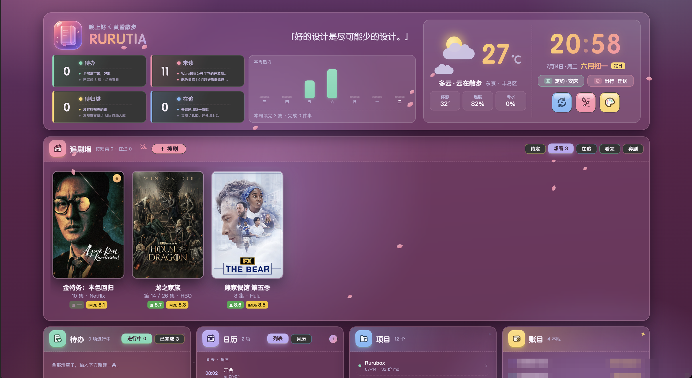
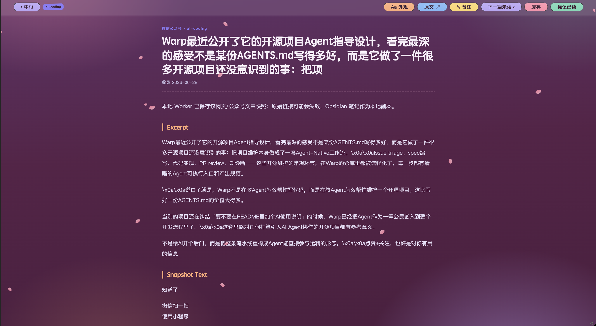
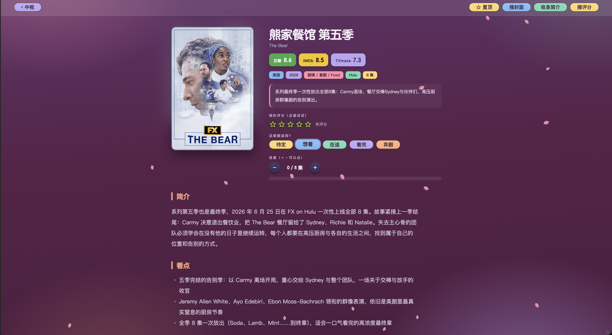
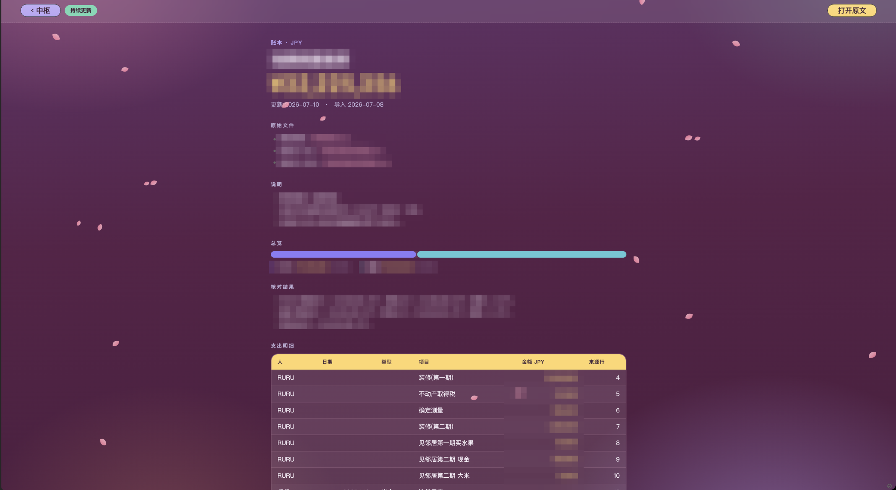

<p align="center">
  
</p>

# RuruOS

一套长在 Obsidian 上的个人知识系统。数据层是朴素的 markdown + frontmatter，界面层是一枚自研插件画出来的糖果色手账中枢——文章、追剧、待办、日程、账本，全在一屏。AI 是可选件：接上 Claude Code 它帮你整理入库，不接一样能用。

<p align="center">
  
</p>

## 它是什么

两层，互不绑架：

- **数据层**：每篇文章、每部剧、每笔账都是一个带 frontmatter 的 `.md` 文件，规范写在 [`AGENTS.md`](AGENTS.md)。哪天你不想用这套界面了,数据拿走就走，任何编辑器都能打开。
- **界面层**：`.obsidian/plugins/obos-home/` 一枚手写插件，无构建链、无 npm 依赖，`main.js` + `styles.css` 两个文件就是全部。改一行、重载一下，立刻生效。

## 功能

| 区域 | 有什么 |
|---|---|
| 中枢顶栏 | 渐变名牌、金句轮换、大字时钟、农历与建除小黄历、天气小剧场（Open-Meteo 免 key）、四统计块、樱花/细雨/落雪/萤火桌面动效 |
| 文章 | 杂志排版阅读器、阅读进度记忆、便利贴备注、Aa 外观面板（字号/版宽/字体/配色）、一周热力柱 |
| 追剧 | 搜剧建档（TVmaze + 豆瓣联想，中英文都行）、九宫格选海报、分季建档、豆瓣/IMDb 徽章、海报墙自动轮播 |
| 生活 | 待办行内编辑、列表/月历双模式日程、自绘糖果日期选择器、macOS 提醒事项/日历同步 |
| 账本 | 流水月度汇总；账本正文的 markdown 表格自动变形——占比表变占比条、小表变统计胶囊、明细变对账单、更新记录变时间线 |
| AI（可选） | 文章浓缩进第二大脑、垃圾文章清杂、剧集资料自动补全、评分查证——全部走本机 claude CLI，没装就自动隐身 |

## 再看两眼

| | |
|---|---|
|  |  |
| 杂志排版阅读器，奶油黄荧光笔 | 剧集详情页，评分徽章与分季档案 |

<p align="center">
  
</p>
<p align="center"><sub>账本详情页。演示图对金额做了遮蔽，库里附带的是虚构示例账本。</sub></p>

## 快速开始

```
git clone https://github.com/yclkoko-afk/RuruOS.git
```

1. 用 [Obsidian](https://obsidian.md) 打开这个文件夹，选「信任并启用社区插件」
2. `Cmd/Ctrl + P` → 执行「打开 RuruOS 中枢」
3. 读库里的 [`从这里开始.md`](从这里开始.md)

然后按你的装备选路线：

| 路线 | 适合谁 | 怎么做 |
|---|---|---|
| A · 不用 AI | 所有人 | 装完即用。搜剧、天气、账本、阅读器全是免费公开 API 或本地功能 |
| B · Claude Code | 想要完整体验 | 装好 claude CLI，插件的 AI 按钮自动激活，对话式整理入库 |
| C · 其他智能体 | Codex / Grok / Hermes / ChatGPT 用户 | 把 [`给智能体的说明书.md`](给智能体的说明书.md) 喂给它，它就会按规范帮你写库 |

细节都在 [`docs/安装指南.md`](docs/安装指南.md)。

## 文档

| 文档 | 干什么用 |
|---|---|
| [`docs/安装指南.md`](docs/安装指南.md) | 从零装到能用，三档路线，常见问题 |
| [`docs/接入AI指南.md`](docs/接入AI指南.md) | 哪些功能免费、哪些烧 AI 额度；四种智能体的接法 |
| [`docs/自定义指南.md`](docs/自定义指南.md) | 改天气城市、换句库、换徽记、开项目卡 |
| [`给智能体的说明书.md`](给智能体的说明书.md) | 复制给任何聊天机器人，它就懂怎么往库里写东西 |
| [`AGENTS.md`](AGENTS.md) | 写入规范的唯一权威（目录职责 + 全部 schema） |
| [`DESIGN.md`](DESIGN.md) | 糖霜设计宪法：色板、组件铁律、禁止清单 |
| [`90-System/开发交接-HANDOFF.md`](90-System/开发交接-HANDOFF.md) | 二次开发交接：架构、约定、几十轮迭代的踩坑史 |

## 关于风格

这套界面的风格叫**糖霜**：糖果六色各司其职、果冻按钮、玻璃拟态手账卡。它经过几十轮真机迭代才定稿，规矩全部写进了 [`DESIGN.md`](DESIGN.md) 和随库自带的 `.claude/skills/tangshuang/`——用 AI 改界面时，AI 会自己读规范替你守住风格。个性化请走六套主题、色相滑杆和 CSS snippet 这三个正门。

## v2.0 路线图（计划中）

- 图形化设置页：天气城市、项目目录、用户名不再改代码
- 豆瓣评分自动抓取（现在靠 AI 按钮或手填）
- 苹果同步脱离「Obsidian 开着」的限制
- 移动端布局适配
- 界面多语言

## License

代码与文档 [MIT](LICENSE)。`20-Reading/Articles/` 内收录的第三方文章版权归原作者，仅作为真实使用示例随库分发，原作者提出异议即移除。

---

<p align="center"><sub>Lulu 和她的 AI 工作室（Nova · Vela · Carina · Mia）做的。v1.0，2026 年夏。</sub></p>
